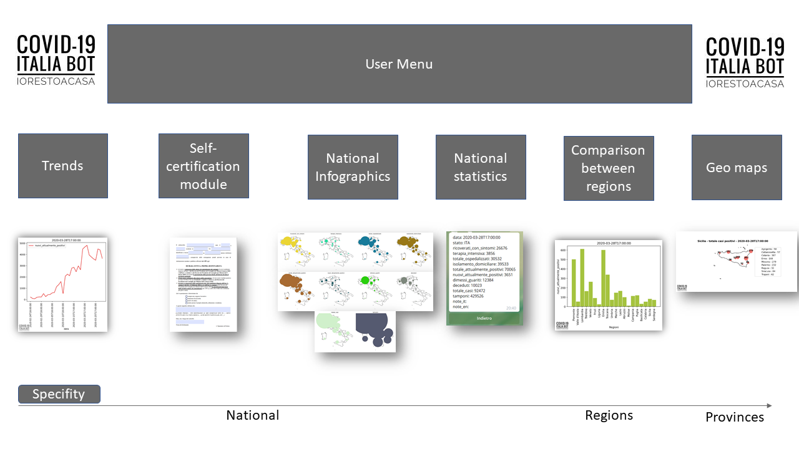

  

# COVID-19 Italia Bot
## Telegram Bot for Data Anlytics and Visualization

The system is based on a bot for the instant messaging platform **Telegram**  with the aim of the diffusion of data on the COVID-19 in Italy, using the collected daily data provided by Protezione Civile.

In order to inform citizens and make the data collected available, useful only for communication and information purposes, our team developed this bot that through chat interface can provide the requested information. 

  

Through the inline interface, users are capable to require information to our core system. With an increasing specificity, is possible to call National, Regional and Provincial Data.

- **Trends** sub menu returns national trends on the main parameters exposed by the dataset day by day
- **Self-Certification module** menu returns blank pdf file for the self certification required
- **National Infographics** sub menu returns at Regional Levels data about infection
- **Comparison beetwen regions** returns bar chart to compare the features of the dataset beetwen different regions
- **GeoMaps** menu uses geo json data mixed to textual data provided in order to build daily map for the various regions with the specifity of provinces.

Below, is presented our flyer used for marketing purposes.

  

